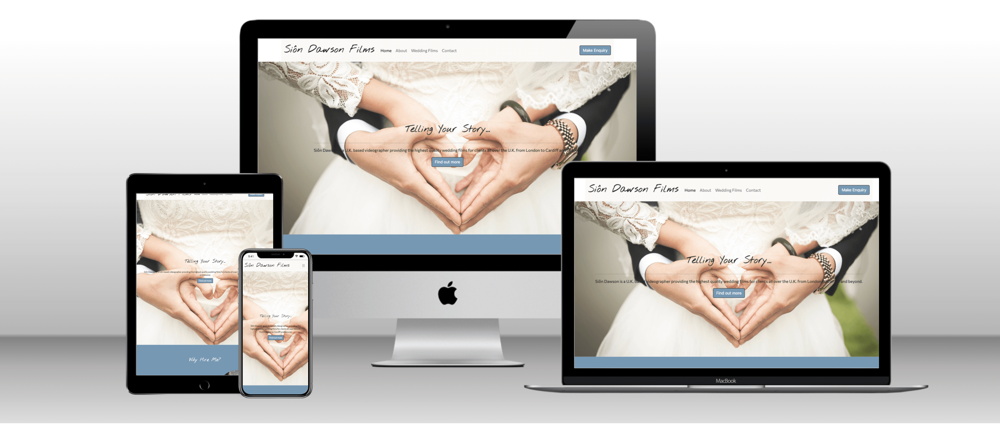
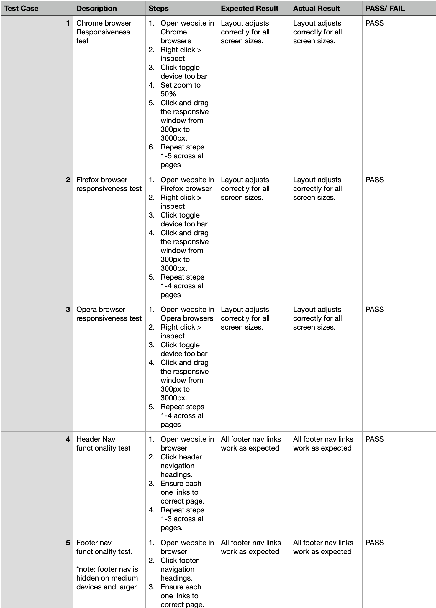

# Milestone Project 1 - Siôn Dawson Films
## Purpose 
This webite was created for Code Institute's Milestone Project 1 assignment. It will also be published and used as online presence for my wedding film business. It was built using knowledge and techniques learsed so far on Code Institute's Full Stack Developer course. A full list of technologies can be found in the technologies section of this document.

The live website can be found [here](https://siondawson.github.io/Milestone-Project-1-Sion-Dawson/)

## Siôn Dawson Films Responsive Website

The Siôn Dawson Films website was built as an online presence for my new wedding films business. In order to showcase my work and connect with potential clients I needed a fully responsive website that could adverstise my services as a wedding videographer. As my background is in music, it was neccacary to include examples of my previous video work to support my image as a good choice for potential clients.

# User Experience Design

## User Stories.

### First Time Visitor Stories
#### As a first time user, I want:
1. To be able to easily understand the purpose of the site and learn more about the site's subject. 
2. To be to easily navigate and view the content.
3. To be able to view the site on any device
4. To be able to find links to social media 
5. To be able to send an a message to obtain a quote for videography services.

### Returning Visitor Stories
#### As a returning visitor, I want:
1. To quicky navigate to information about the available service.
3. To send a message requesting a quote for the advertised service.
4. To find contact information to contact the sites owner directly (without the use of the contact form)

### Frequent Visitor Stories
#### As a frequent visitor, I want:
1. To see if there is any new example videos uploaded.
2. Go get in contact with the sites owner after booking if I have not saved their contact information.

# Structure

## Bootstrap 
### Structure
Bootstrap version 5 was used to structure this website. The most notable code used form bootstraps compoents are the nav bar and footer. This was used as bootstraps nav bar componant will collapse into a hamburger style menu automatically for smaller screens. Without the need to code from scratch. 

Bootstrap columns and rows have been used throughout to structure the content and make it responsive accross all screen sizes. 

Bootstrap classes have been used to add padding and margins. Make containser stretch full width, center text and hide certain elements on smaller screens.  

###

## Home Page
### Header Nav
Each page will contain a navigation menu at the top of the page for simple and fast exploration of the site. This will collapse into a 'hamburger' style menu for medium and smaller screen sizes. This code is taken from bootstraps componant library and modified to suit the needs of this website. 

This will allow user to easily navigate the site.
### Footer Nav
Each page will also contain a smaller nav bar in the footer for easy navigation after viewing the content on the page. To save space this will be hidden on mobile screens. 

This will give users a secondary navigation menu so they dont need to scroll to the top to move to a different page. 
### Title and background image.
The home page will feature a title and sentence so that the user knows immediately the sites purpose. This section will have a background image to draw in the user.
### Three Reasons
After scrolling down the user will be given three reasons why I would make a good choice as their wedding videographer.
### Background video
After the three reasons there will be a short video playing in the background. The video will have no sound as will be built into the site as a 'moving background'. 

As the purpose of the site is to encourage potential clients to enquire about hiring me as their wedding videographer. This is an important feature and comes at the cost of a slower loading time for the website. This was deemed however no so slow that performance was hampered to the point that it effected UX. The video will have a heading element empashising the quality of the films. 
### Nav buttons 
As the main purpose of the site is to advertise my services as a videographer additional navigation buttons will be placed strategically to lead visitors from the 'home' to 'about' to 'wedding films' and finally the 'contact' page. Additional navigation buttons will also be placed to prompt user to proceed to the contact page and send an enquiry as soon as possible.
## About page
The about section will contain an image of me along with a short bio. Underneath this there will be three music videos of my own creation, highlighting my background in music whilst also assuring the user of my experience in film making. Each video will have a short explanation of it's content. 
## Wedding films page
The wedding films page will contain more in depth information about my wedding films. The two main elements at the top of the page will be a iframe containing an example of one of my wedding films for visitors to view, along with a short paragraph. Underneath this there will be six headings with corresponding paragraph showing visitors what they will recieve by booking me as their videographer. Each heading will be supported by an appropriate fontawesome icon. After the six headings, users will see a button calling them to make an enquiry. This will lead them to the contact page.
## Nav CTA buttons
CTA Navigation buttons will also be strategically placed on all pages to lead visitors to immediately enquire. This gives users easy access to the contact page whilst they are viewing the content. 
## Thank-you page
After visitors send an enquiry they will be directed to a 'thank-you' page where they will recieve confirmation that their message has been recieved. This page will only be accessed by sending an message. The page will feature a button inviting them to return to the home page to continue viewing the content. The purpose of this page is for users to know that their enquiry message has been recieved. 

## Footer Social Links
Sion Dawson films social media branded profiles have not yet been created. I therefore included links to my own instagram. The youtube channel is an old account which my example wedding films is uploaded as unlisted link. These accounts will likely be rebranded in preperation of publication of website. Current links provided for code institute project submission.
# Design 

### Color Scheme

Two colors where chosen after trialling many different shades. Research into different color schemes was a carried out on various websites incluing adobe color picker. The built in HEX color picker in gitpod was used finalise the background shades of blue (#7698b3) and green (#e0e4e1). 

### Typography

Two fonts were chosen via google fonts. 'Nothing You Could Do' for headings. 'Commissioner' for paragraphs, buttons and navigation. Nothing you could do was primarily chosen as an inital logo. In future a more elaborate logo will be created.

### Imagery 

As this website is for promotion of a wedding film business stills from previous work will be used. All images displayed on the site are of my own creation, with the exeception of the home page background image which is used under the free pixabay licence. 

## Wireframes

[Wireframes can be found here](https://github.com/siondawson/Milestone-Project-1-Sion-Dawson/tree/main/assets/wireframes)

## Differences to design 

In order to show how the projects design evolved from wireframe to implementation I have included original wireframes and will explain differences below. Surface plane design changes choices we're made based on what looked/ worked best in practice vs. in  planning at the skeleton plane.

### Home Page 

* Background image set over main H1 title and paragraph. Height set to 90% leaving small amount of content below to lead user to next section. 
* Background video and three reasons sections exchanged position. This layout seemed better than wireframe plan. 
* Three reasons section seemed bare. Images added next to each reason to increase visual appeal. Bootstrap ordering classes were used to best format text and images on different screen sizes. 
* Customer quote replaced with centered heading emphasizing that videos are shot in 4k.
* There was additional space in the nav bar. So I decided to include a CTA button to make an enquiry in the nav. The button is hidden on screen sizes where there is no space for it. This allows returning users, or those who wish to enquire right away and easy navigation button direct to the contact page.

### About Page

* Extra video added and button moved underneath.
* Video caption text moved below videos instead of above.

### Contact Page

* I found bootstraps contact forms difficult to work with in terms of layout and formatting. 
* Centered form layout was replaced with similar layout to signup form in 'Love Running' project. Modified to suit needs of my project as a contact form. Entirely custom layout with exception of bootstrap columns. Ideal background image was allready loaded into gitpod.

### Thankyou page

* In project midpoint meeting my tutor pointed out that the user has no way of knowing if a message has been sent from contact form. She suggested adding a simple thank-you page linked from the 'send message' button of the contact form. 
* A simple message with a button to return to the home page is all that was required.
* No wireframe was created for this aspect during the skeleton plane. Page was simple enough to not require one. 

# Technologies

* HTML
    * HTML was used to complete the structure of the website
* CSS
    * CSS was used to style the website
* [Bootstrap 5](https://getbootstrap.com/docs/5.0/getting-started/introduction/)
    * Bootstrap 5 was used as a frame work to structure and style the website.
* [Fontawesome](https://fontawesome.com/) 
    * Fontawesome icons were used as visual aids in headings and for social media links. 
* [Google fonts](https://fonts.google.com/)
    * Used throughout the website to import the fonts used.
* [Adobe Color](https://color.adobe.com/create/color-wheel)
    * Used to explore color palette
* [TinyJPG.com](https://tinyjpg.com/)
    * Used to compress images in order to reduce bandwidth.
* [Favicon](https://favicon.io/)
    * favicon.io was used to create site favicon.
* [Techsini](https://techsini.com/)
    * Used to create apple device mockup above in this readme.
* [Pixabay](https://pixabay.com/)
    * Used to download [heart image that is used on the home page](https://pixabay.com/photos/heart-wedding-marriage-hands-529607/)
* [Wave](https://wave.webaim.org/)
    * Used to test accessibility. For Color contrast and screen readers.

# Testing 

## Test Strategy

This project is a static website and contains no back-end functionality. Testing will be performed on the websites visual layout and navigation functionality. 

All nav links should function as per their names. All buttons should function as per their name implies.

All links will open in a new browser.

The contact form will be tested to ensure required fields are completed and to ensure valid data is input.

## Test Results

Full test results can be found [here](https://github.com/siondawson/Milestone-Project-1-Sion-Dawson/blob/main/assets/testing-sion-dawson-films.pdf). 
I have provided a .pdf and .xlsx copies of the spreadsheet. The .xlsx will require excel or compatible program to open. Please note that in exporting from Apple Numbers the bullet point formatting was automatically removed.

All pages were run through the W3C HTML Validator and showed no errors.

CSS code was run through the W3C CSS validator with no errors found.

### First time user stories:
1. To be able to easily understand the purpose of the site and learn more about the site's subject. 
    * Testing was performed to ensure all contact was displayed correctly on all screen sizes, accross all pages 
2. To be to easily navigate and view the content.
    * Testing was performed on all nav links and buttons to ensure they function as expected. 
3. To be able to view the site on any device
    * Testing was performed accross three browsers at screen sizes between 300px-3000px.
4. To be able to find links to social media 
    * Testing was performed to ensure social media links would open correctly. 
5. To be able to send an a message to obtain a quote for videography services.
    * Testing was performed to ensure contact form functioned correctly. Note: at this stage contact form is not linked to a server as it's out of scope for milestone project 1.

### Returning user stories:
1. To quicky navigate to information about the available service.
    * Testing was performed on all nav links.
3. To send a message requesting a quote for the advertised service.
    * Testing was performed to ensure contact form functions correctly.
4. To find contact information to contact the sites owner directly (without the use of the contact form)
    * Testing was performed to ensure content and information is displayed correctly accross all device sizes.

### Frequent user stories:

1. To see if there is any new example videos uploaded.
    * Testing was perfromed to ensure videos play correctly and user controls are present.
2. Go get in contact with the sites owner after booking if I have not saved their contact information.
    * Testing was performed to ensure all information and content is displayed correctly accross all device sizes.

## Issues found during testing

1. Image on about page seemed too small on smaller screen sizes.
 * Media queary added to increase it's with on smaller screen sizes.
2. Background image on index.html appears zoomed in too far on tablets and mobile. Only when ran on real devices. (see test case 19)
    * Issue caused by scrolling backgrounds not supported on iOS devices.
    * Media queary added to adjust background attachment from scroll to fixed for smaller devices.
    * Upon contacting tutor support, they suggested a work around that would sacrifice the fixed background on smaller screen for a page that would look good on all devices. 
    * Scrolling background therefore lost on smaller devices but still looks good.
    * Decision made that this solution although not perfect is better than content not appearing correctly on iOS devices.
3. Background video on index.html does not play on real mobile devices. Only first frame is displayed. (see text case 18)
    * First frame only displaying makes a good background image - so I have decided to leave this as is. 
4. Contact form taller than background image and therefore scrolls. Gives an appearance of a sticky footer. Not effecting functionality or UX but could be improved. 
    * This issue was fixed with the flex box approach in [this documentation](https://css-tricks.com/couple-takes-sticky-footer/).
    * Following this I discovered the page was appearing as desired in dev tools, but not on my iphone.
    * Problem was that scrolling backgrounds are not supported on iOS devices.
    * (See solution found above in issues found in testing: issue 2 - same fix).
5. Favicon not displaying on deployed site.
    * This was a filepath issue. 
    * All favicon files moved to their own folder within assets.
    * Filepath changed to relative.
    * Issue resolved.
6. On running the website through [Wave](https://wave.webaim.org/) one remaining color contrast issue was detected. The heading over the background video on the home page. Moving background meant some white on white. As background is moving the heading is readable over enough of the video to ignore this warning. 

# Deployment 
This project was created using the code institute template.
## Version Control

This site was created using Visual Studio Code editor and pushed to 'Milestone-Project-1-Sion-Dawson', a remote repository in github. 

Throughout the project these commands were used to save work and push changes to github via the command line terminal.

1. Type: git add .
    * This command add files to the staging area before committing.
2. Type: git commit -m "your message explaining what updates were made"
    * This command commits changes to the local repository
3. Type: git push
    * This command pushes all changes to the GitHub repository.

## Deployment to github pages

1. Navigate to this projects [github repository](https://github.com/siondawson/Milestone-Project-1-Sion-Dawson)
2. Click 'settings' tab.
3. Scroll down to the git hub pages heading.
4. Select 'master branch' as the source.
5. Click the save button.
6. Click on the link to go to the live deployed page.

## Clone the repository code to your machine

Navigate to the [github repository](https://github.com/siondawson/Milestone-Project-1-Sion-Dawson)

1. Click on the code drop down button.
2. Click HTTPS
3. Copy repository link
4. Open your IDE (git must be installed)
5. Type git clone (copied git url) into the terminal.

The project will now have been cloned on your machine. 

# Credits 

## Content
The content of this software was created by Sion Dawson.

## Media 
The photos and video in this project were created by Sion Dawson. The only exception is the home page 'heart-img.jpg.' which was downloaded for free, for use anywhere from [pixabay.com](https://pixabay.com/photos/heart-wedding-marriage-hands-529607/).

## Acknowledgements
Thankyou to my tutor Daisy McGirr for her help and guidance in this project. Thanks also to my wife Samantha (code institute alumni) for helping me overcome problems and discussing ideas.

